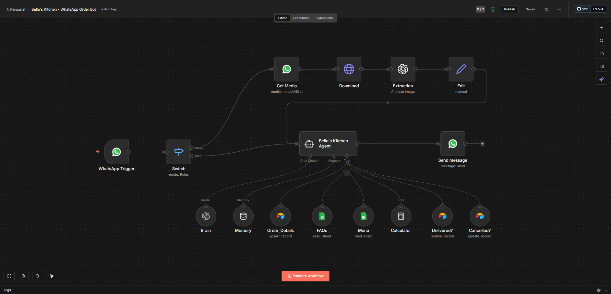
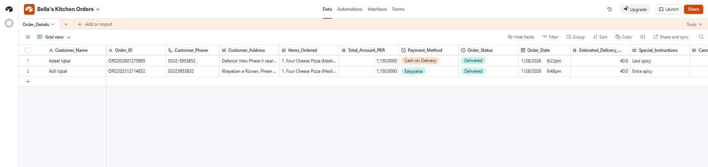
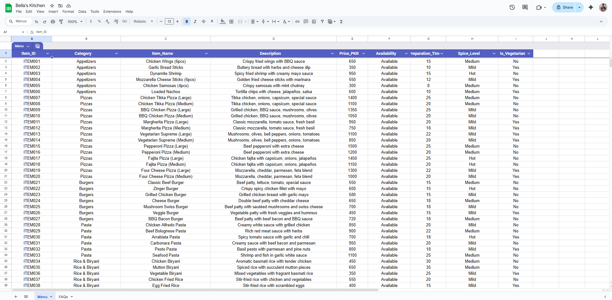
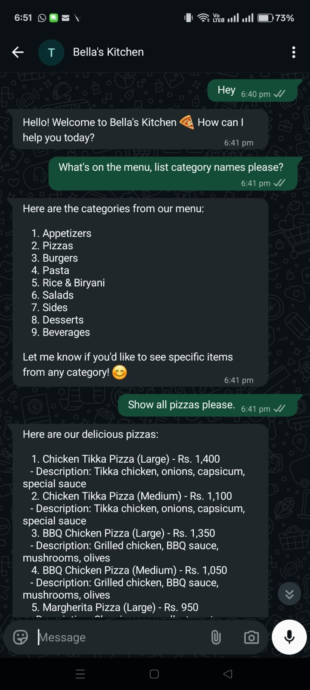
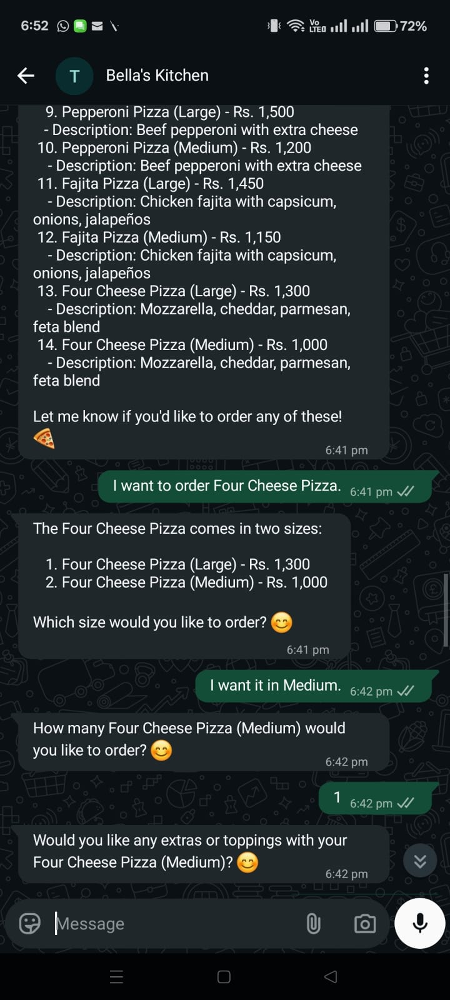
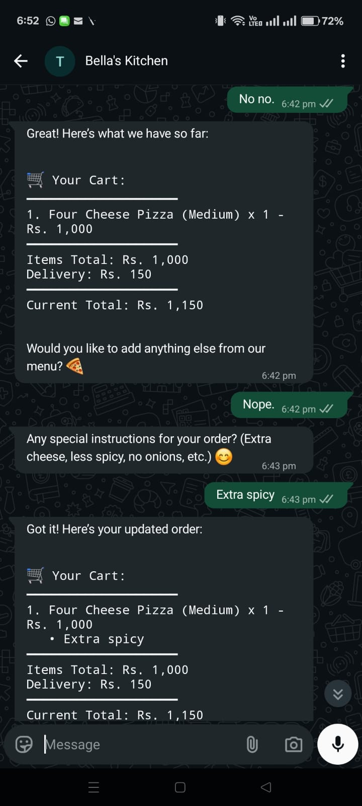
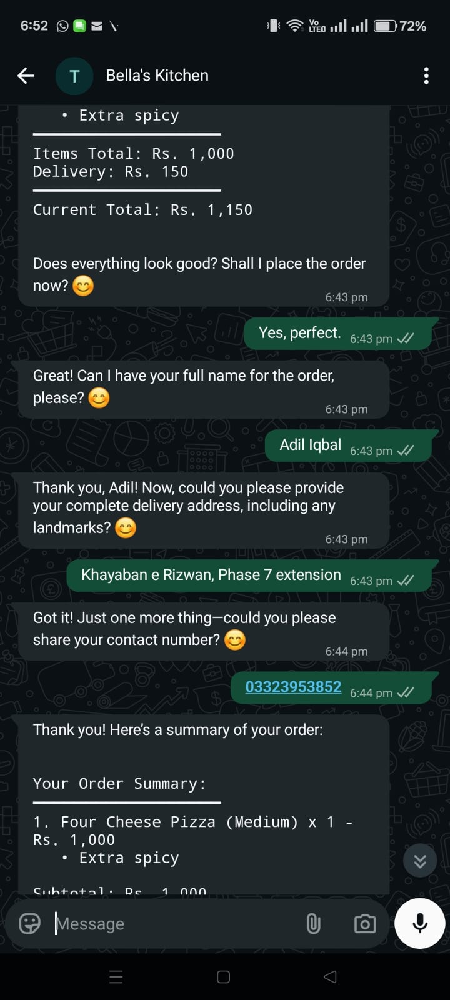
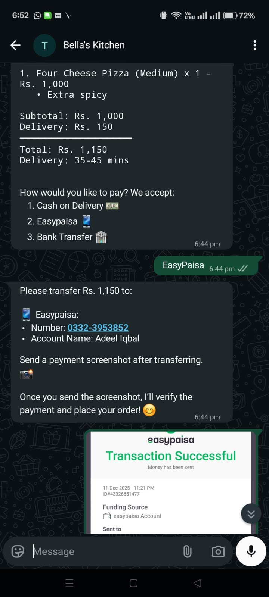
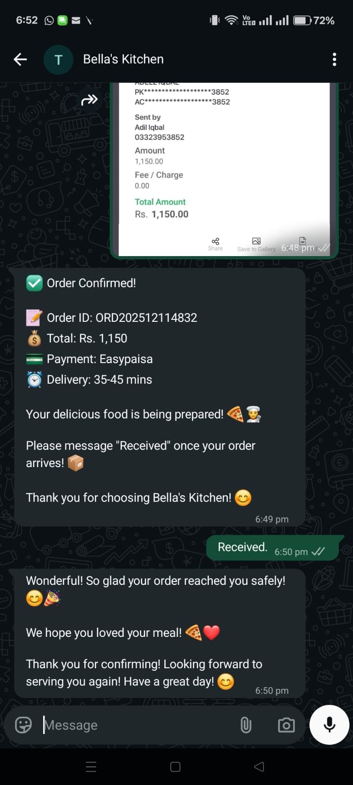

# 🍕 RestoBot - WhatsApp Restaurant Ordering Agent

> **AI-powered WhatsApp bot that takes restaurant orders like a human waiter - 24/7, no app needed!**

[](https://n8n.io)
[](https://openai.com)
[](https://airtable.com)
[](https://business.whatsapp.com)



---

## 🎯 What is RestoBot?

RestoBot is an intelligent WhatsApp chatbot that automates restaurant ordering end-to-end. Customers order naturally through WhatsApp (which they already use daily), and the bot handles everything - from showing menus to verifying payments to tracking deliveries - just like a human waiter would.

**No app downloads. No new platforms. Just WhatsApp.** 📱

---

## 💡 The Problem

### For Restaurant Owners:
- **Staff Shortage** - Hard to find and retain reliable order-taking staff
- **Peak Hour Chaos** - Missing calls and orders during busy times
- **High Operational Costs** - Salaries for dedicated order management staff
- **Human Errors** - Wrong orders, missed special instructions, calculation mistakes
- **Limited Hours** - Can't take orders when staff isn't available

### For Customers:
- **Long Wait Times** - Holding on the phone during busy hours
- **App Fatigue** - Don't want to download another restaurant app
- **Complex Ordering** - Difficult to specify variations, add-ons, special requests
- **Payment Hassles** - Limited payment options or unclear payment verification

---

## ✅ The Solution

RestoBot automates the entire ordering process through WhatsApp:

1. **Greets customers** warmly and naturally
2. **Shows menu** with prices, sizes, and descriptions
3. **Takes orders** item by item with variations and add-ons
4. **Builds cart** dynamically and shows running total
5. **Collects details** - name, address, phone, special instructions
6. **Handles payments** - Cash on Delivery, Easypaisa, or Bank Transfer
7. **Verifies payment screenshots** automatically for online payments
8. **Creates order** in database with all details
9. **Tracks delivery** status and confirmations
10. **Manages cancellations** with time-based rules (10-minute window)

All through natural conversation on WhatsApp! 🤖

---

## ✨ Key Features

### 🤖 Smart Conversational AI
- **Human-like interaction** - Converses in friendly Pakistani English
- **Context awareness** - Remembers conversation history across messages
- **Natural ordering** - Asks follow-up questions like a real waiter
- **Menu intelligence** - Fetches live menu data, never outdated

### 🛒 Cart-Based Ordering
- **Progressive cart building** - Add items one by one
- **Live cart display** - Shows current order after each item
- **Variations & add-ons** - Handles sizes (Small/Medium/Large), toppings, extras
- **Special instructions** - Per-item and overall order instructions
- **Accurate calculations** - Auto-calculates subtotal, delivery, and total

### 💳 Payment Verification
- **Multiple payment options** - Cash on Delivery, Easypaisa, Bank Transfer
- **Screenshot verification** - AI analyzes payment receipts automatically
- **Smart matching** - Verifies amount (±Rs. 10 tolerance) and recipient details
- **Fraud prevention** - Only creates order after verified payment for online methods

### 📊 Order Management
- **Complete tracking** - Order ID, customer details, items, amounts, timestamps
- **Status updates** - Pending → Delivered → Cancelled workflow
- **Delivery confirmation** - Customers confirm receipt via WhatsApp
- **Cancellation handling** - 10-minute window for order cancellations
- **Airtable database** - All orders stored and accessible

### 📱 WhatsApp Integration
- **No app needed** - Works on customer's existing WhatsApp
- **Image processing** - Handles payment screenshots
- **Instant responses** - Real-time conversation
- **Message history** - Maintains context across conversation

---

## 🔄 How It Works

### Order Flow:

```
Customer sends "Hi" on WhatsApp
    ↓
Bot greets and shows menu categories
    ↓
Customer browses and selects items
    ↓
Bot asks for size/quantity/add-ons per item
    ↓
Bot displays updated cart with totals
    ↓
Customer confirms order
    ↓
Bot asks for special instructions
    ↓
Bot collects delivery details (name, address, phone)
    ↓
Bot offers payment options
    ↓
[COD Path]                    [Online Payment Path]
Bot creates order    →    Bot shows payment details
                               ↓
                          Customer sends screenshot
                               ↓
                          Bot verifies payment
                               ↓
                          Bot creates order
    ↓
Bot sends order confirmation with Order ID
    ↓
[After Delivery]
Customer sends "Received"
    ↓
Bot marks order as Delivered
    ↓
Done! ✅
```

## 🛠️ Technology Stack

### Core Technologies:
- **n8n** - Workflow automation and orchestration
- **OpenAI GPT-4o-mini** - Natural language understanding and generation
- **Airtable** - Order database and management
- **WhatsApp Business API** - Customer communication
- **Google Sheets** - Menu and FAQ management

---

## 📸 Screenshots

### System Architecture

*Complete n8n workflow showing all nodes and connections*

### Database Structure

*Airtable database with order records, status tracking, and customer details*

### Menu Management

*Easy-to-edit menu in Google Sheets with items, prices, and descriptions*

### WhatsApp Conversations

<table>
  <tr>
    <td></td>
    <td></td>
    <td></td>
  </tr>
  <tr>
    <td></td>
    <td></td>
    <td></td>
  </tr>
  <tr>
    <td align="center"><i>Greeting & Menu</i></td>
    <td align="center"><i>Item Selection</i></td>
    <td align="center"><i>Cart Building</i></td>
  </tr>
  <tr>
    <td align="center"><i>Delivery Details</i></td>
    <td align="center"><i>Payment Verification</i></td>
    <td align="center"><i>Order Confirmation</i></td>
  </tr>
</table>

*Complete conversation flow from greeting to order confirmation*

---

## 💰 Benefits

### For Restaurant Owners:

**Cost Savings:**
- Save Rs. 30,000-50,000/month on order-taking staff salaries
- Reduce order errors and refunds
- No app development or maintenance costs

**Operational Efficiency:**
- Handle unlimited concurrent orders
- 24/7 availability - even when restaurant is closed
- Instant order documentation - no manual entry
- Automatic payment verification - no manual checking

**Better Customer Service:**
- Instant responses - no waiting on hold
- Accurate orders - items, quantities, and prices recorded perfectly
- Clear payment process - reduced confusion and disputes

**Scalability:**
- Same efficiency for 10 orders or 1000 orders per day
- Easy menu updates - just edit Google Sheet
- Add new items or change prices in seconds

### For Customers:

**Convenience:**
- Order from WhatsApp they already use daily
- No app downloads or registrations
- Natural conversation - like talking to a person
- See cart and total before confirming

**Clarity:**
- Clear menu with prices and descriptions
- Running total always visible
- Order confirmation with all details
- Easy to specify special instructions

**Flexibility:**
- Multiple payment options
- Order anytime - 24/7 availability
- Easy to modify items during ordering
- Cancel within 10 minutes if needed

---

## 🎯 Use Cases

Perfect for:

- 🍕 **Pizza & Fast Food Shops** - High volume, standard items with variations
- ☕ **Cafes & Bakeries** - Custom orders with add-ons and special requests
- 🍜 **Cloud Kitchens** - Delivery-only, need efficient order management
- 🏠 **Home-Based Food Businesses** - Small operations, can't afford full staff
- 🥘 **Multi-Cuisine Restaurants** - Complex menus, many options
- 🚚 **Delivery Services** - Need accurate order capture and tracking

**Any food business taking orders on WhatsApp can benefit!**

---

## 💼 Get This Solution

### 🎁 What's Included:

**Complete System Setup:**
- ✅ Fully configured n8n workflow
- ✅ AI agent with conversational intelligence
- ✅ Payment verification system
- ✅ Order management database (Airtable)
- ✅ Menu & FAQ management (Google Sheets)
- ✅ WhatsApp Business API integration

**Customization:**
- ✅ Your restaurant's menu, prices, and items
- ✅ Your branding and tone of voice
- ✅ Your payment accounts (Easypaisa, Bank details)
- ✅ Your delivery areas and charges
- ✅ Your working hours and policies

**Documentation & Support:**
- ✅ Setup guide and walkthrough
- ✅ Menu/FAQ management training
- ✅ Order management guide
- ✅ Troubleshooting documentation
- ✅ 30-day post-launch support

### 📦 Pricing Packages:

**Note:** Contact for detailed pricing based on your specific needs.

---

## 🔧 Custom Automation Solutions

Beyond restaurant ordering, I build custom automation solutions for businesses.

### My Approach:

1. **Understand Your Problem** - What are you trying to solve?
2. **Design the Solution** - Map out the workflow and logic
3. **Build & Test** - Create the automation and verify it works
4. **Deploy & Support** - Launch and provide ongoing assistance

---

## 📞 Contact

Interested in RestoBot or custom automation solutions?

**Adeel Iqbal**

📧 **Email:** adeelmemon096@yahoo.com  
📱 **WhatsApp:** +92 314 7116890  
💼 **LinkedIn:** [linkedin.com/in/adeeliqbalmemon](https://linkedin.com/in/adeeliqbalmemon)  
🔗 **GitHub:** [github.com/adeel-iqbal](https://github.com/adeel-iqbal)

**Let's discuss how automation can transform your business!**

---

## 📄 License

This project is proprietary software. All rights reserved.

**For Business/Commercial Use:**
- Contact me for licensing and implementation
- Custom pricing based on requirements
- Full support and customization included

**Not Open Source:**
- Source code and workflows are not publicly available
- This repository showcases the project capabilities
- Implementation requires direct engagement

For inquiries about using this solution, please reach out via email or WhatsApp.

---

## 🙏 Acknowledgments

Built with powerful tools and technologies:
- [n8n](https://n8n.io) - Workflow automation platform
- [OpenAI](https://openai.com) - GPT-4o-mini language model
- [Airtable](https://airtable.com) - Database and order management
- [WhatsApp Business API](https://business.whatsapp.com) - Messaging platform
- [Google Sheets](https://sheets.google.com) - Menu and FAQ management

---

**Made with ❤️ in Karachi, Pakistan 🇵🇰**

*Helping Pakistani businesses grow with practical automation solutions.*

---

### ⭐ Like this project?

If you're a restaurant owner or know someone who could benefit, feel free to reach out!

If you're a recruiter or fellow developer, check out my other work on [GitHub](https://github.com/adeel-iqbal).

**Always open to interesting automation challenges!** 🚀
